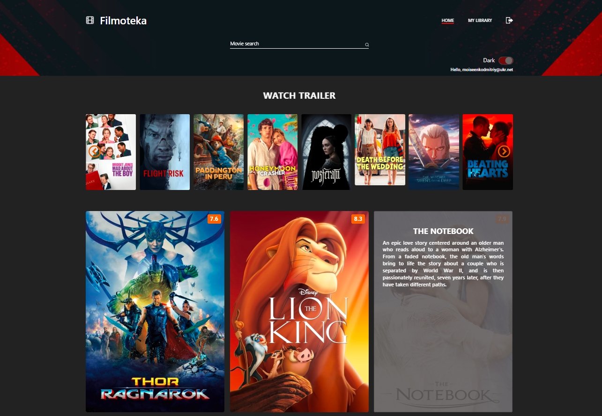

# Filmoteka

## Стек технологій

## Опис проекту

`Сайт пошуку фільмів:` Створення власної бібліотеки фільмів для перегляду і
улюблених фільмів, які ви, можливо, забажаєте переглянути ще. На головній
сторінці вам пропонується список поточних популярних фільмів.

`Основна функція:` Пошук фільмів: користувачі можуть шукати фільми за їх назвою,
використовуючи форму введення "Пошук фільмів". Ви можете ознайомитися з описом
про фільм, наводячи курсор на нього.

`Детальна інформація про фільм:` Клацнувши на постер фільму, ви отримуєте доступ
до додаткових функцій: Додати до WATCH: Додає фільм до черги на перегляд у
бібліотеці. Видалити з WATCH: Видаляє фільм із черги на перегляд у бібліотеці.
Додати до FAVORITES: Додає фільм до списку улюблених. Видалити з FAVORITES:
Видаляє фільм зі списку улюблених.

`Переглянути трейлер:` Переглянути оригінальний трейлер.

`Реєстрація:` Можливість зареєструватися.

`Темна тема:` Зміна палітри кольорів сайту на темні, для комфорту очей.

`Інші:` Пагінація, швидкий перегляд трейлеру, відтворення інформації про
користувача, скрол до шапки сайту і інші можливості.

`Посилання на сайт:` https://filmoteka-kohl.vercel.app/
